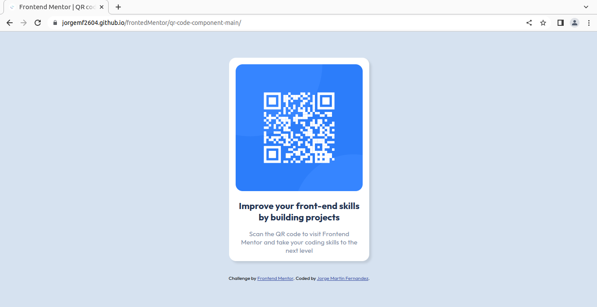

# Frontend Mentor - QR code component solution

This is a solution to the [QR code component challenge on Frontend Mentor](https://www.frontendmentor.io/challenges/qr-code-component-iux_sIO_H). Frontend Mentor challenges help you improve your coding skills by building realistic projects. 

## Table of contents

- [Overview](#overview)
  - [Screenshot](#screenshot)
  - [Links](#links)
- [Author](#author)

**Note: Delete this note and update the table of contents based on what sections you keep.**

## Overview

### Screenshot

### Links

- Solution URL: [Github repo](https://github.com/jorgemf2604/frontedMentor/tree/main/qr-code-component-main)
- Live Site URL: [Github pages](https://jorgemf2604.github.io/frontedMentor/qr-code-component-main/)

## My process

### Built with

- Semantic HTML5 markup
- CSS custom properties
- Flexbox

## Author
- Github - [@jorgemf2604](https://github.com/jorgemf2604)
- Frontend Mentor - [@jorgemf2604](https://www.frontendmentor.io/profile/jorgemf2604)

